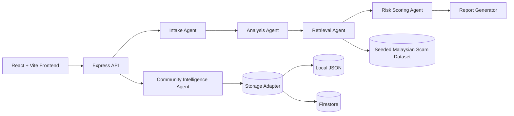

# ScamShield Malaysia

AI-powered multimodal scam detection, explanation, and community intelligence for Malaysia.

## Problem Statement

Scammers in Malaysia move fast across SMS, WhatsApp, Telegram, spoofed URLs, fake parcel notices, investment pitches, and impersonation calls. Most consumers see fragmented warning signs, but not a single product that helps them understand risk clearly, act safely, and contribute anonymized community intelligence.

ScamShield Malaysia turns suspicious messages, links, phone numbers, and screenshots into a structured risk analysis with Malaysian context, recommended actions, and a searchable privacy-safe community feed.

## Why It Matters In Malaysia

- Malaysia faces persistent parcel scams, Macau scams, fake bank alerts, job scams, OTP phishing, and social engineering targeting DuitNow, Touch 'n Go eWallet, KWSP, and government aid narratives.
- Many victims only realize the danger after they click, transfer money, or reveal TAC / OTP codes.
- A localized trust-and-safety layer can improve scam prevention, digital literacy, and future collaboration with banks, telcos, and public agencies.

## Features

- Multimodal intake for suspicious text, URLs, phone numbers, and screenshots
- Structured AI analysis with risk score, verdict, confidence, red flags, explanation, and recommended actions
- Malaysia-specific contextual guidance and response steps
- Community intelligence feed with anonymized report submission and search
- Seeded Malaysian scam pattern retrieval to ground analysis
- Mock AI mode that keeps the entire product demoable without API keys
- Docker, CI, and Cloud Run deployment scaffolding

## Architecture Overview

## Agentic AI Workflow

1. Intake Agent detects input mode, normalizes content, and extracts machine-usable signals.
2. Analysis Agent inspects scam indicators and produces structured reasoning fields.
3. Retrieval Agent compares the case against seeded Malaysian scam patterns and community reports.
4. Risk Scoring Agent combines heuristics, retrieval matches, and model output into a calibrated 0–100 score.
5. Report Generator returns strict JSON for frontend rendering.
6. Community Intelligence Agent redacts risky PII and normalizes anonymized reports for storage and search.

## Tech Stack

| Layer | Stack |
| --- | --- |
| Frontend | React, Vite, Tailwind CSS, Framer Motion |
| Backend | Node.js, Express, Firebase Genkit, Zod |
| AI Provider | Gemini via Google AI Studio with mock fallback |
| Storage | Local JSON adapter by default, Firestore adapter optional |
| Tooling | Docker, GitHub Actions, Vitest, ESLint |

## Local Setup

1. Copy `.env.example` to `.env`.
2. Install dependencies with `npm install`.
3. Start the full stack with `npm run dev`.

## Mock Mode

Set `MOCK_AI=true` or leave `GEMINI_API_KEY` empty. The app will still run end-to-end and return realistic demo analyses without external credentials.

## Environment Variables

| Variable | Purpose |
| --- | --- |
| `PORT` | Backend HTTP port |
| `CLIENT_ORIGIN` | Frontend origin for CORS |
| `MOCK_AI` | Enables provider fallback for demos without credentials |
| `GEMINI_API_KEY` | Google AI Studio Gemini API key |
| `DEFAULT_MODEL` | Model identifier for the Gemini provider |
| `STORAGE_PROVIDER` | `local` or `firestore` |
| `LOCAL_REPORTS_PATH` | Local JSON storage path for community reports |
| `FIRESTORE_PROJECT_ID` | Firestore project ID for optional cloud storage |
| `FIRESTORE_COLLECTION` | Firestore collection name |
| `FIRESTORE_KEY_JSON` | Optional JSON service-account payload |

## Deployment Strategy

- Primary target: Google Cloud Run with a single Docker image serving the API and built frontend.
- Development path: local Node or Docker with zero cloud dependencies.
- Optional preview path: container deployment to a temporary free-tier platform if desired.

## GitHub Actions

- `ci.yml` installs dependencies, lints, tests, and builds both frontend and backend.
- `cloudrun-deploy-template.yml` is a workflow-dispatch template that becomes usable once GCP credentials are added.

## AI Usage Disclosure

AI coding tools were used during development. All code has been reviewed and can be explained.

## Privacy And Security Notes

- Community reports are stored in redacted, privacy-safe form.
- The app is designed to avoid retaining raw personal identifiers in community intelligence data.
- Secrets are injected only through environment variables.

## Demo Walkthrough

1. Analyze a fake parcel fee SMS.
2. Analyze a phishing URL impersonating a Malaysian bank or wallet.
3. Analyze a suspicious phone number.
4. Upload a screenshot of a scam conversation.
5. Submit an anonymized report and show it in the community feed.

## Future Roadmap

- Telco and bank integrations for live reputation signals
- Deeper OCR and device-side threat detection
- Malay-language model tuning and multilingual explanations
- Fraud campaign clustering and alerting dashboards

## License

MIT

