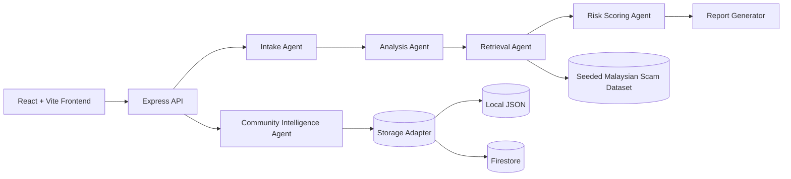

# ScamShield Malaysia

AI-powered multimodal scam detection, explanation, and community intelligence for Malaysia.

## Problem Statement

Malaysians are hit by parcel fee scams, Macau scams, fake bank alerts, job scams, wallet verification traps, and phishing pages that pressure them to act fast. Most people can sense that something feels wrong, but they still need help answering the hard part:

- Is this actually dangerous?
- What are the red flags?
- What should I do right now?
- Has the same pattern already been reported by others?

ScamShield Malaysia turns suspicious text, URLs, phone numbers, and screenshots into a structured risk analysis with Malaysian context, recommended action, and a privacy-safe community intelligence loop.

## Why It Matters In Malaysia

- Scam narratives often impersonate trusted local brands and institutions such as Maybank, CIMB, Touch 'n Go eWallet, KWSP, LHDN, PDRM, Bank Negara, and courier services.
- Scam harm happens quickly once a victim clicks a phishing link, transfers funds, or shares TAC / OTP details.
- Malaysia needs a trust-and-safety layer that supports scam prevention, fraud awareness, community reporting, and future integrations with banks, telcos, and public agencies.

## Feature List

- Analyze suspicious text messages, chats, emails, and copy-pasted content
- Analyze suspicious URLs and phishing domains
- Analyze suspicious phone numbers
- Upload screenshots of scam attempts or fake payment / wallet pages
- Return structured AI output:
  - risk score (0–100)
  - confidence
  - verdict
  - red flags
  - concise explanation
  - recommended actions
  - Malaysia-specific context
- Submit anonymized scam reports to a searchable community feed
- Search seeded and community-reported scam patterns
- Run fully in mock mode without API keys
- Switch to live Gemini mode later through environment variables

## Architecture Overview



## Agentic AI Workflow

ScamShield Malaysia uses Firebase Genkit explicitly as the orchestration layer.

1. Intake Agent
   - detects whether input is text, URL, phone, or image
   - normalizes content
   - extracts tokens, URLs, phone digits, and file metadata
2. Analysis Agent
   - runs provider-backed reasoning through a swappable AI layer
   - supports `mock` mode and `gemini` mode
   - produces strict structured output
3. Retrieval Agent
   - matches against seeded Malaysian scam patterns
   - matches against privacy-safe community reports
4. Risk Scoring Agent
   - combines heuristics, retrieval similarity, community similarity, and model output
   - returns a calibrated 0–100 score with a score breakdown
5. Report Generator
   - packages strict JSON for the frontend
   - prepares a privacy-safe community report draft
6. Community Intelligence Agent
   - sanitizes user-submitted descriptions
   - redacts phone, email, and URL details
   - rejects risky identifiers such as NRIC-like and bank-account-like strings

## Repo Structure

```text
scamshield-malaysia/
  README.md
  LICENSE
  .gitignore
  .env.example
  Dockerfile
  docker-compose.yml
  backend/
    data/
    src/
  frontend/
    public/demo/
    src/
  docs/
    architecture.md
    demo-script.md
    slides-outline.md
    submission-copy.md
  scripts/
    dev.js
    seed-data.js
  .github/workflows/
    ci.yml
    cloudrun-deploy-template.yml
```

## Tech Stack

| Layer | Stack |
| --- | --- |
| Frontend | React 19, Vite, Tailwind CSS 4, Framer Motion, Lucide |
| Backend | Node.js, Express, Zod, Multer, Pino |
| AI orchestration | Firebase Genkit |
| AI provider | Gemini via Google AI Studio with mock fallback |
| Storage | Local JSON adapter by default, Firestore adapter optional |
| Testing | Vitest, Supertest, Testing Library |
| DevOps | Docker, Docker Compose, GitHub Actions, Cloud Run template |

## Local Setup Instructions

1. Clone the public repository.
2. Copy `.env.example` to `.env`.
3. Install dependencies:

```bash
npm install
```

4. Reset the local runtime report store:

```bash
npm run seed
```

5. Start the backend and frontend dev servers:

```bash
npm run dev
```

6. Open `http://localhost:5173`.

## Mock Mode Instructions

Mock mode is the default path for zero-credential development and demos.

- Leave `GEMINI_API_KEY` empty
- Keep `MOCK_AI=true`
- Run `npm run dev`

The app will still:

- start successfully
- accept text, URL, phone, and image inputs
- return realistic structured scam analysis
- allow community report submission and search

## Environment Variables

| Variable | Required | Purpose |
| --- | --- | --- |
| `PORT` | No | Backend port |
| `CLIENT_ORIGIN` | No | Allowed frontend origin for CORS |
| `NODE_ENV` | No | `development`, `test`, or `production` |
| `LOG_LEVEL` | No | Pino log level |
| `MOCK_AI` | No | Forces mock provider mode |
| `GEMINI_API_KEY` | No | Google AI Studio Gemini API key |
| `GENKIT_ENV` | No | Genkit environment label |
| `DEFAULT_MODEL` | No | Gemini model name, default `gemini-2.5-flash` |
| `STORAGE_PROVIDER` | No | `local` or `firestore` |
| `LOCAL_REPORTS_PATH` | No | Runtime JSON path for user-submitted reports |
| `FIRESTORE_PROJECT_ID` | No | Firestore project ID |
| `FIRESTORE_COLLECTION` | No | Firestore collection name |
| `FIRESTORE_KEY_JSON` | No | Optional service-account JSON payload |
| `MAX_UPLOAD_MB` | No | Upload limit for image analysis |
| `RATE_LIMIT_WINDOW_MS` | No | Express rate-limit window |
| `RATE_LIMIT_MAX` | No | Express rate-limit cap per window |
| `VITE_API_BASE_URL` | No | Optional frontend override for API base URL |

## API Summary

| Method | Route | Purpose |
| --- | --- | --- |
| `GET` | `/api/health` | Health, provider mode, seed counts, storage mode |
| `GET` | `/api/samples` | Demo inputs for the frontend |
| `POST` | `/api/analyze` | Multimodal analysis endpoint |
| `GET` | `/api/reports` | Community report search / list |
| `POST` | `/api/reports` | Submit a privacy-safe community report |

## Local Docker Run

Build and run the production bundle locally:

```bash
docker compose up --build
```

Then open `http://localhost:8080`.

## Deployment Strategy

Primary target:

- Google Cloud Run with one Docker image serving the built frontend and backend API

Current development path:

- zero-GCP local development
- mock AI mode by default
- Firestore optional behind an adapter

Optional temporary preview path:

- deploy the Docker image to a low-friction container host such as Render, Fly.io, Railway, or another temporary preview service if a public live demo is needed before GCP credentials are available

## GitHub Actions Explanation

### `ci.yml`

Runs on pushes and pull requests and performs:

- `npm ci`
- `npm run lint`
- `npm run test`
- `npm run build`

### `docker-build.yml`

Runs entirely on GitHub Actions hosted runners and performs:

- `docker build`
- container startup in mock mode
- `/api/health` smoke check
- `/api/analyze` smoke check

### `gemini-live-smoke.yml`

Manual GitHub Actions workflow that:

- uses the repository secret `GEMINI_API_KEY`
- starts the backend in live Gemini mode
- confirms `/api/health` reports `providerMode: gemini`
- runs a real analysis smoke test with retries

### `cloudrun-deploy-template.yml`

A manual `workflow_dispatch` template that becomes active once GitHub secrets are added for:

- GCP project
- region
- workload identity provider
- deploy service account
- Cloud Run service name

It is intentionally safe to keep in the repo before credentials exist.

The repository secret `GEMINI_API_KEY` can be stored in GitHub Actions for future workflow use without exposing it in this public repository.

## AI Usage Disclosure

AI coding tools were used during development. All code has been reviewed and can be explained.

## Privacy And Security Notes

- Community reports store sanitized summaries, not raw victim details
- Phone numbers, emails, and URLs are redacted from user-submitted reports
- NRIC-like and bank-account-like identifiers are rejected from report submission
- The backend uses rate limiting, upload limits, and structured validation on every route
- Secrets are environment-variable only and are never hardcoded

## Demo Walkthrough

1. Open the homepage and frame the Malaysian scam problem.
2. Paste the parcel-fee SMS demo and show the structured score, verdict, and red flags.
3. Switch to URL mode and analyze a spoofed banking URL.
4. Switch to image mode and load the demo wallet screenshot.
5. Show the community intelligence feed and search an existing scam pattern.
6. Use the latest analysis to prefill a sanitized community report and submit it.
7. Close with architecture, privacy controls, Docker support, CI, and Cloud Run readiness.

## Submission Assets

- [Architecture](docs/architecture.md)
- [Demo Script](docs/demo-script.md)
- [Slides Outline](docs/slides-outline.md)
- [Submission Copy](docs/submission-copy.md)

## Real-World Positioning

ScamShield Malaysia is positioned as a scalable trust-and-safety layer for:

- scam prevention
- fraud awareness
- community intelligence
- digital literacy
- future bank, telco, and public-sector integrations

## Future Roadmap

- Live reputation feeds from banks, telcos, and national reporting channels
- Better OCR and screenshot understanding for scam visuals
- Malay-language and multilingual explanation tuning
- Scam campaign clustering, trend detection, and alert subscriptions
- Enterprise integration for financial institutions and trust-and-safety teams

## License

MIT
