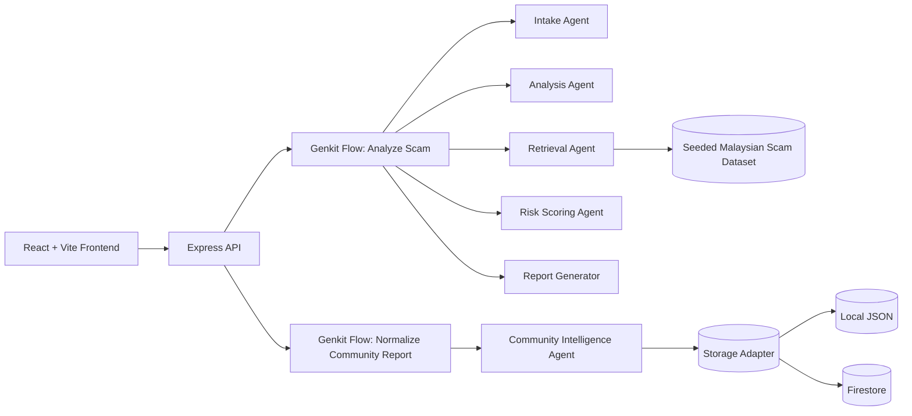

# Architecture

## Goals

- Keep the product demoable with zero cloud credentials
- Make the AI workflow explicit, explainable, and visible
- Ground analysis in Malaysian scam patterns instead of pure model intuition
- Preserve privacy in the community intelligence loop
- Stay Cloud Run compatible from the beginning

## System Diagram

## Request Flow

### Analysis

1. Frontend sends text, URL, phone, or multipart image input to `/api/analyze`
2. Intake Agent normalizes content and detects embedded URLs / phone numbers
3. Retrieval Agent scores similarity against:
   - `backend/data/malaysian_scam_seed.json`
   - seeded community reports
   - user-submitted reports from the selected storage adapter
4. Analysis Agent calls:
   - mock provider if `MOCK_AI=true` or no `GEMINI_API_KEY`
   - Gemini provider otherwise
5. Risk Scoring Agent combines heuristics, retrieval, community similarity, and model output
6. Report Generator returns frontend-ready JSON

### Community Reporting

1. Frontend submits a privacy-safe summary to `/api/reports`
2. Community Intelligence Agent sanitizes and rewrites the report
3. Risky identifiers are redacted or rejected
4. Storage adapter writes only normalized report data
5. Search requests merge seeded and user-submitted reports

## Storage Strategy

### Local JSON

- default mode
- no cloud account required
- ideal for demos, CI, and local development

### Firestore

- optional future activation
- same interface as local JSON
- keeps the app compatible with Cloud Run deployment later

## Scoring Strategy

The final score is intentionally composite:

- `35%` heuristic score
- `20%` seeded-pattern retrieval
- `10%` community similarity
- `35%` provider / model assessment

This makes the result more robust than a single model call and also keeps mock mode meaningful when credentials are absent.

