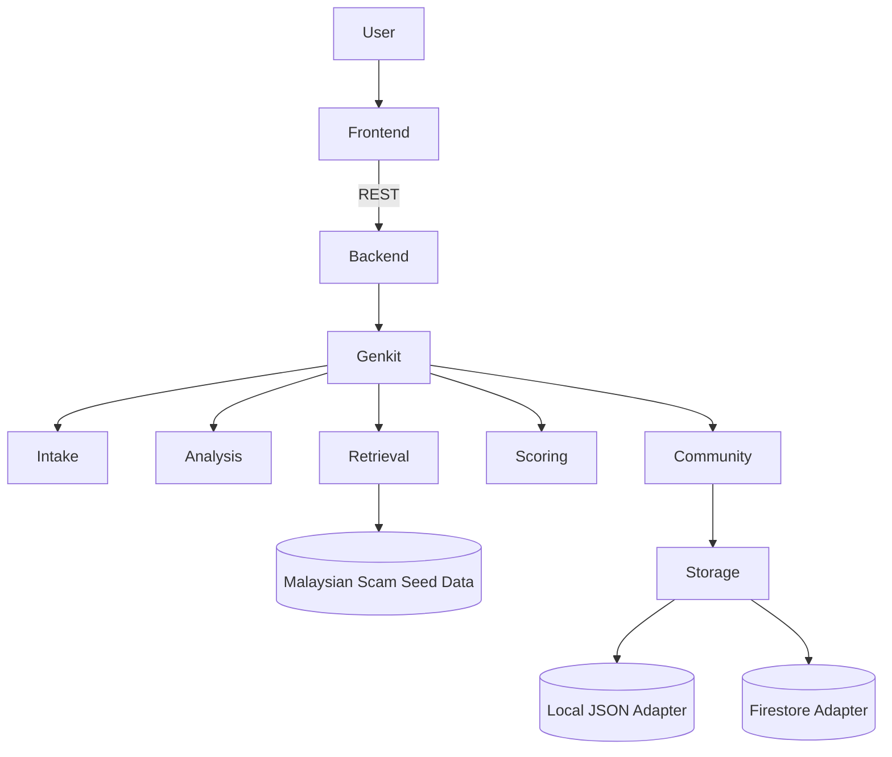

# Architecture

## System View

## Design Goals

- Demo reliably with zero cloud credentials
- Make AI visibly central, explainable, and structured
- Keep storage privacy-safe and easy to swap later
- Stay Cloud Run friendly from day one

